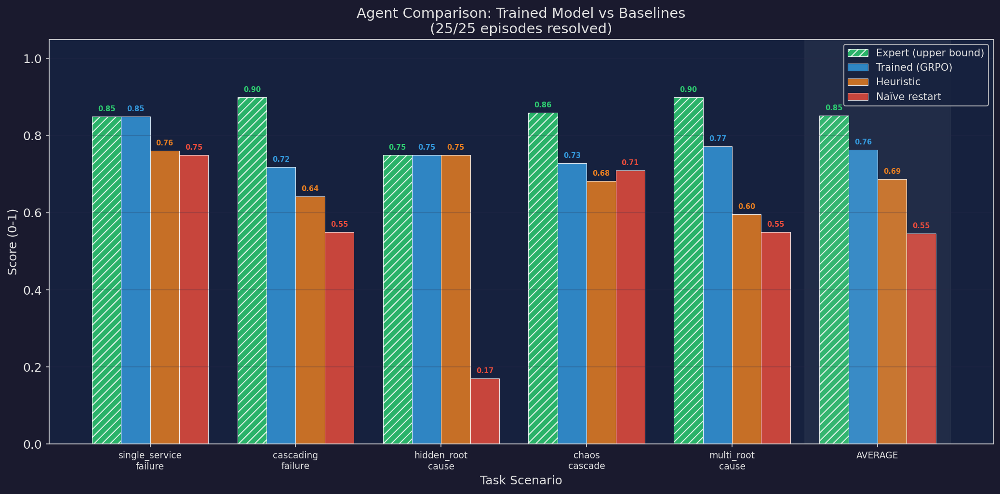

# Incident Commander: Training AI to Manage Production Outages

## The Problem

Production outages cost enterprises an average of $300,000 per hour. When an on-call engineer gets paged at 3am, they face dozens of simultaneously firing alerts across a complex microservices architecture. They have minutes to diagnose the root cause, fix it without breaking more things, and restore service — all while cascading failures spread across the dependency graph. Today, this process relies entirely on human expertise and institutional knowledge.

We built **Incident Commander**, a reinforcement learning environment that trains AI agents to be expert Site Reliability Engineers. Our environment simulates realistic production outages in a 6-service microservices system, complete with dependency-aware failure propagation, misleading symptoms, and live chaos injection.

## Our Environment

Incident Commander is an [OpenEnv](https://github.com/huggingface/openenv)-compliant environment built with FastAPI. The agent plays the role of an Incident Commander and must:

1. **Observe** — Read service health metrics, alerts, and logs across 6 microservices
2. **Diagnose** — Identify the root cause among misleading symptoms
3. **Act** — Execute targeted recovery actions (restart, scale, rollback, clear cache)
4. **Verify** — Confirm system recovery before the step limit

### The Microservices Stack

| Service | Role | Weight | Dependencies |
|---|---|---|---|
| **database** | Foundational data store | 25% | None |
| **cache** | Redis cache layer | 10% | None |
| **auth** | Authentication & JWT | 20% | database, cache |
| **notification** | Messaging service | 5% | None |
| **payments** | Payment processing | 20% | database, notification |
| **checkout** | User-facing checkout | 20% | auth, payments, database |

### Task Difficulty Levels

| Task | Difficulty | Scenario | Max Steps |
|---|---|---|---|
| `single_service_failure` | Easy | Cache OOM crash → auth degraded | 15 |
| `cascading_failure` | Medium | Database overload → 4-service cascade | 20 |
| `hidden_root_cause` | Hard | Bad auth deploy masked by stale cache tokens | 30 |
| `chaos_cascade` | Hard | DB crash + surprise notification failure at step 8 | 35 |
| `multi_root_cause` | Expert | Auth bad deploy AND database CPU spike simultaneously | 40 |
| `random_incident` | Variable | Randomized root cause, failure mode, and downstream effects | 15-25 |

## What Makes It Different

### 1. Multi-Specialist Agent Architecture

Unlike single-agent approaches, we implement a **coordinator-specialist pattern** with four distinct roles:

- **Coordinator (Incident Commander)** — Reads the full system state and delegates to the appropriate specialist. It develops a "theory of mind" about which expert is best suited for each failure type.
- **DB Expert** — Specializes in database and cache diagnostics and recovery
- **Infra Expert** — Handles infrastructure-wide operations: cascading restarts, scaling, rollbacks
- **App Expert** — Focuses on application-layer issues: auth, payments, checkout failures

This architecture directly addresses **Theme #1 (Multi-Agent Systems)** — the coordinator must model the capabilities and limitations of each specialist to make optimal delegation decisions.

### 2. Randomized Incidents

Instead of fixed scenarios that agents can memorize, our `random_incident` task generates unique episodes by randomly selecting:
- Root cause service (any of the 6)
- Failure mode (OOM, bad deploy, CPU spike, network partition)
- Number and identity of affected downstream services (1-3)

This ensures the agent must develop genuine diagnostic reasoning, not pattern matching.

### 3. Live Chaos Injection

When `chaos_mode` is enabled, a background **ChaosAgent** randomly injects new failures during an episode (15% probability per step after step 5). This simulates the real-world scenario where new problems emerge while you're fixing existing ones. The agent must handle dynamically evolving incidents — a dramatic and audience-friendly demo feature.

### 4. Partial & Noisy Logs

Real SRE work doesn't give you clean telemetry. Our environment degrades log quality based on failure mode:
- **OOM crashes** → `empty` logs (dead services can't emit logs)
- **CPU spikes** → `partial` logs (40-60% of lines dropped, last entry truncated)
- **Bad deploys** → `misleading` logs (blame wrong services — the agent must cross-reference metrics)
- **Healthy services** → `full` logs (baseline)

This forces the agent to develop robust diagnostic reasoning under uncertainty.

### 5. Real-Time Severity Escalation

Incidents don't wait for you. Our environment implements **4 escalation tiers** where damage progressively worsens:

| Tier | Steps | Effect | Revenue Loss/Step |
|---|---|---|---|
| 1 (Stable) | 0-3 | Initial state | $5k/min |
| 2 (Spreading) | 4-7 | Root cause degrades further | $15k/min |
| 3 (Cascading) | 8-12 | Direct dependents start failing | $30k/min |
| 4 (Full Outage) | 13+ | All unhealthy services worsen | $60k/min |

The observation includes `escalation_tier` and `services_at_risk` so the agent can anticipate cascading damage.

### 6. Runbook Memory (Retrieval-Augmented RL)

Our agent builds **institutional knowledge across episodes** — just like a real SRE team. A persistent `RunbookMemory` stores incident resolution patterns and injects relevant past runbooks into the observation space at episode start.

- Agent can `write_runbook` to save learnings (+0.05 reward for correct root cause)
- Past runbooks are auto-retrieved by incident fingerprint similarity
- Using a runbook suggestion for the first fix action earns +0.08 bonus
- Graded as a 5th component: **Memory Utilization (10%)**

### 7. SLA Time Pressure

In HTTP server mode, episodes have **wall-clock time limits** (Easy=120s, Medium=180s, Hard=300s). The observation shows `time_remaining` and `time_pressure` (normal/high/critical). Exceeding the SLA incurs a -0.10 terminal penalty. This creates authentic urgency during live demos.

## Reward Design

Our reward function combines per-step shaped rewards with a final episode score:

### Per-Step Shaped Rewards

| Signal | Reward | Rationale |
|---|---|---|
| Health improvement | `+Δhealth × 2.0` | Primary recovery signal |
| Inspect root cause (first time) | `+0.05` | Encourage diagnosis before action |
| Inspect other service (first time) | `+0.02` | Reward systematic investigation |
| Correct recovery action | `+0.15` | Strong signal for right fix |
| Wrong target (healthy service) | `-0.03` | Penalize random fixing |
| Repeated action | `-0.05` | Prevent loops |
| Wasted step (do_nothing during incident) | `-0.03` | Time pressure |
| Revenue loss (tier-based) | `-0.005` to `-0.060` | Business-impact-grounded cost |
| Chaos survival (no health loss) | `+0.05` | Reward resilience |
| Runbook write (correct root cause) | `+0.05` | Reward knowledge capture |
| Runbook-guided first fix | `+0.08` | Reward institutional learning |
| Resolution bonus | `+0.20 + efficiency bonus` | Fast resolution rewarded |

### Final Episode Grading (0.0 — 1.0)

| Component | Weight | Description |
|---|---|---|
| **Recovery** | 35% | Did system return to full health? |
| **Efficiency** | 20% | How quickly was it resolved? (blends step + wall-clock in HTTP mode) |
| **Diagnostics** | 15% | Did agent investigate before acting? |
| **Ordering** | 20% | Were actions in correct dependency order? |
| **Memory** | 10% | Did agent leverage runbook data and contribute knowledge? |

## Results

<!-- TODO: Fill in after Bangalore training with GRPO -->

*Training results will be added after fine-tuning with HuggingFace TRL/GRPO during the hackathon compute session.*

**Baseline Performance:**



| Agent | Avg Score | Notes |
|---|---|---|
| Random Agent | ~0.05 | Benchmark floor |
| Heuristic Agent | ~0.40 | Rule-based, no learning |
| LLM Agent (GPT-4o-mini) | ~0.55 | Zero-shot, no training |
| **Trained Agent (GRPO)** | **TBD** | *Coming after Bangalore* |

## Architecture

```
┌─────────────┐
│ Coordinator  │ ← Reads full observation
│  (IC Agent)  │ → Delegates to specialist
└──────┬──────┘
       │
  ┌────┴───────────────────┐
  │          │              │
  ▼          ▼              ▼
┌──────┐ ┌────────┐ ┌──────────┐
│  DB  │ │ Infra  │ │   App    │
│Expert│ │ Expert │ │  Expert  │
└──┬───┘ └───┬────┘ └────┬─────┘
   │         │           │
   └─────────┼───────────┘
             │
             ▼
    ┌─────────────────┐
    │  Environment     │
    │  (FastAPI/OpenEnv)│
    │  6 microservices │
    │  + ChaosAgent    │
    └─────────────────┘
```

## Try It

- **GitHub**: [Repository Link]
- **HuggingFace Space**: [Space Link]
- **Docker**: `docker build -t incident-commander-env . && docker run -p 8000:8000 incident-commander-env`

### Quick Start

```bash
# Install dependencies
pip install -e .

# Start the environment server
python -m server.app

# Run single-agent inference
python inference.py

# Run multi-agent inference
python multi_agent_inference.py --task hidden_root_cause

# Run with chaos mode
python multi_agent_inference.py --task random_incident --chaos

# Benchmark baselines
python run_baselines.py --episodes 20

# Generate reward curves
python plot_baselines.py
```

## Team

Incident Commander Team — OpenEnv Hackathon 2026
